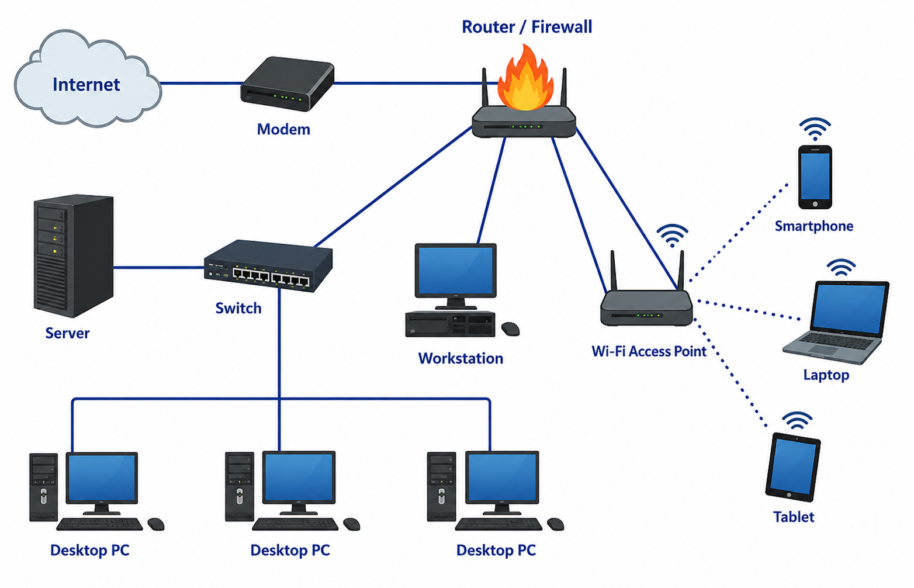

# Comprehensive Cloud Networking Tutorial

Welcome to the **Comprehensive Beginner-to-Advanced Tutorial on Computer Networking, Data Center Networking, Cloud Networking, and Cloud-Native Infrastructure**.

This tutorial is designed as a complete training course suitable for IT professionals, Data Engineers, DevOps Engineers, Cloud Engineers, Software Engineers, and Computer Science students. It progresses logically from the absolute basics of how computers talk to each other to complex cloud-native architectures and observability patterns.

## Course Objectives

By the end of this course, you will be able to:
- Understand core networking fundamentals, including the OSI model, IP addressing, and subnetting.
- Configure and troubleshoot basic routing, switching, and network security.
- Design and comprehend Data Center network architectures (e.g., Spine-Leaf).
- Understand virtualization, containers, and Kubernetes networking (CNI, Pods, Services).
- Architect robust Cloud Networking environments in AWS, Azure, or GCP.
- Design networks for data engineering platforms and distributed microservices.
- Follow the complete end-to-end flow of a web request across modern infrastructure.

## Table of Contents

The course is divided into logical sections. Please follow the links below to access the modules:

### [Part 1: Networking Fundamentals](./module-01-to-04-fundamentals.md)
* **Module 1**: Networking Fundamentals
* **Module 2**: OSI and TCP/IP Models
* **Module 3**: IP Addressing and Subnetting
* **Module 4**: Network Devices

### [Part 2: Routing, Switching & Security](./module-05-to-07-routing-security.md)
* **Module 5**: DNS and Internet Infrastructure
* **Module 6**: Routing and Switching
* **Module 7**: Network Security

### [Part 3: Data Centers & Virtualization](./module-08-to-11-datacenter-containers.md)
* **Module 8**: Data Center Networking
* **Module 9**: Virtualization
* **Module 10**: Containers
* **Module 11**: Kubernetes Networking

### [Part 4: Cloud & Cloud-Native](./module-12-to-14-cloud-native.md)
* **Module 12**: Cloud Computing Fundamentals
* **Module 13**: Cloud Networking
* **Module 14**: Cloud-Native Architecture

### [Part 5: Data Infrastructure & Observability](./module-15-to-17-data-observability.md)
* **Module 15**: Data Engineering Infrastructure
* **Module 16**: Observability and Monitoring
* **Module 17**: Complete End-to-End Request Flow

### [Appendices](./interview-questions.md)
* [Interview Questions (Networking, Cloud, Data Center)](./interview-questions.md)
* [Hands-on Labs, Tools, and Glossary](./labs-tools-glossary.md)

---

## Learning Roadmap: From Beginner to Expert

If you are just starting out, use this roadmap to guide your learning:

### 🟢 Phase 1: The Foundations (Modules 1-5)
**Goal:** Understand how computers communicate and how the Internet works.
- Grasp the OSI model and packet lifecycle.
- Master IPv4 subnetting (Crucial for later cloud modules).
- Understand what switches, routers, and DNS do.

### 🟡 Phase 2: Core Infrastructure & Security (Modules 6-9)
**Goal:** Learn how enterprise networks are built and secured.
- Dive into routing protocols (BGP, OSPF) and VLANs.
- Understand firewalls, VPNs, and TLS.
- Learn how traditional Data Centers operate (Spine-leaf, SAN).
- Grasp hypervisors and VMs.

### 🟠 Phase 3: The Modern Application Era (Modules 10-14)
**Goal:** Move from physical/virtual machines to the Cloud and Containers.
- Master Docker and Kubernetes networking concepts (Pods, Ingress, CNI).
- Deep dive into Cloud VPCs, Subnets, Transit Gateways, and Peering.
- Understand microservices, API Gateways, and Service Meshes.

### 🔴 Phase 4: Big Data & End-to-End Mastery (Modules 15-17)
**Goal:** Apply networking to distributed systems and understand the full picture.
- Learn how data platforms (Kafka, Spark, Snowflake) utilize networks.
- Set up monitoring and observability (Prometheus, Grafana, OpenTelemetry).
- Trace a single packet from a user's browser all the way to a database backend.

Ready? Let's get started with [Part 1: Networking Fundamentals](./module-01-to-04-fundamentals.md).
