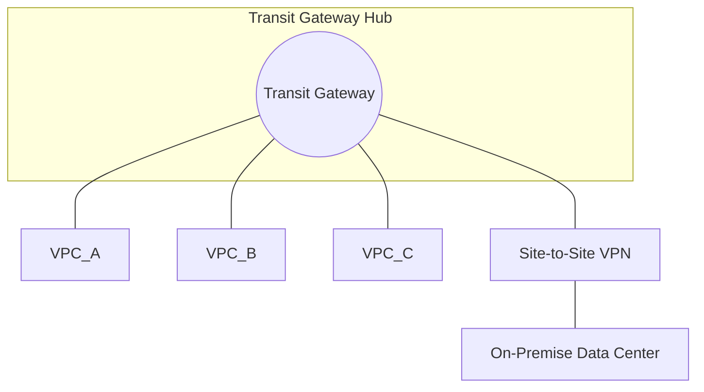

# Part 4: Cloud & Cloud-Native

This section covers how to architect networks in public clouds (AWS, Azure, GCP) and how modern cloud-native applications are structured.

---

## MODULE 12: CLOUD COMPUTING FUNDAMENTALS

Cloud computing is the on-demand delivery of IT resources over the Internet with pay-as-you-go pricing. Instead of buying physical servers, you rent compute power, storage, and databases from a cloud provider.

### The Cloud Service Models
* **IaaS (Infrastructure as a Service):** You rent the basic building blocks—virtual servers (VMs), storage, and networking. You manage the OS and everything on top. (e.g., AWS EC2).
* **PaaS (Platform as a Service):** You provide the code; the cloud provider manages the underlying infrastructure, OS, and runtime. (e.g., AWS Elastic Beanstalk, Heroku).
* **SaaS (Software as a Service):** A complete, hosted application used by end-users. (e.g., Gmail, Salesforce).

### Cloud Deployment Models
* **Public Cloud:** Infrastructure owned and operated by third-party providers (AWS, Azure, GCP) and delivered over the internet.
* **Private Cloud:** Cloud infrastructure used exclusively by a single organization (often hosted in their own on-premise Data Center using tools like OpenStack).
* **Hybrid Cloud:** Connecting a Private Cloud (or traditional Data Center) to a Public Cloud securely via a VPN or dedicated connection.
* **Multi-Cloud:** Using multiple public cloud providers simultaneously (e.g., using AWS for compute and GCP for machine learning).

### Shared Responsibility Model
Security in the cloud is shared.
* **Security *OF* the Cloud (Provider):** The cloud provider is responsible for physically securing the data centers, the hardware, and the hypervisor layer.
* **Security *IN* the Cloud (Customer):** You are responsible for securing your OS, application code, data, and *network firewall configurations*.

> **Module 12 Key Takeaways:** Cloud computing shifts CapEx (buying hardware) to OpEx (renting). Remember the Shared Responsibility model: if you leave a database open to the public internet, it is your fault, not Amazon's.

---

## MODULE 13: CLOUD NETWORKING

Cloud Networking applies traditional networking concepts (subnets, routing, firewalls) into a software-defined, virtualized cloud environment.

### VPC (Virtual Private Cloud)
A VPC is your own logically isolated slice of the public cloud. It is a virtual network dedicated to your cloud account. (Equivalent: AWS VPC, Azure Virtual Network (VNet), Google Cloud VPC).

### Subnets: Public vs. Private
When you create a VPC (e.g., `10.0.0.0/16`), you divide it into subnets.
* **Public Subnet:** Has a direct route to the Internet. Used for Load Balancers and Bastion Hosts (Jump servers).
* **Private Subnet:** Has NO direct route to the Internet. Used for Application Servers, Databases, and backend systems. This is a critical security boundary.

### Cloud Networking Components
* **Internet Gateway (IGW):** A horizontally scaled, highly available cloud router that connects your VPC to the public internet.
* **NAT Gateway:** Sits in the Public Subnet. Allows instances in the *Private Subnet* to initiate outbound connections to the internet (e.g., to download software updates) but prevents the internet from initiating connections back to them.
* **Route Tables:** Every subnet is associated with a route table, which contains rules dictating where network traffic is directed.

### Cloud Security Firewalls
* **Security Groups (SGs):** Act as a virtual firewall for your *instances* (VMs). They are **stateful**. You assign an SG to an EC2 instance to say "Only allow port 80 from the Load Balancer."
* **Network ACLs (NACLs):** Act as a virtual firewall for your *subnets*. They are **stateless**. They act as an additional layer of defense around the perimeter of the subnet.

### Connecting Networks Together
* **VPC Peering:** A direct, 1-to-1 network connection between two VPCs. (If VPC A peers with VPC B, and B peers with C, A *cannot* talk to C automatically. It is not transitive).
* **Transit Gateway (TGW):** A central cloud router that connects thousands of VPCs and on-premise networks together. It solves the headache of managing hundreds of 1-to-1 peering connections using a hub-and-spoke model.

> **Module 13 Key Takeaways:** The golden rule of Cloud Networking architecture is putting internet-facing resources in Public Subnets and backend resources/databases in Private Subnets, using a NAT Gateway for outbound access.

---

## MODULE 14: CLOUD-NATIVE ARCHITECTURE

"Cloud-Native" doesn't just mean running in the cloud; it means designing applications specifically to take advantage of cloud elasticity and distributed computing.

### Monolith vs. Microservices
* **Monolith:** All application logic (UI, business rules, database access) is compiled into a single massive program. Hard to scale, hard to update.
* **Microservices:** Breaking the application down into small, independent, loosely-coupled services that communicate over the network (usually via HTTP APIs or gRPC).

### The Networking Challenges of Microservices
When an app is split into 50 microservices, the network becomes the most critical component.
1. **Service Discovery:** How does Service A find the IP address of Service B when Service B is running in ephemeral containers?
2. **Resilience:** What happens if the network drops a packet between Service A and B?
3. **Security:** How do we encrypt traffic between services?

### Solutions: API Gateway and Service Mesh
* **API Gateway:** The front door. It handles all North-South traffic (user to cluster). It handles authentication, rate limiting, and routes the user's request to the correct microservice.
* **Service Mesh (e.g., Istio, Linkerd):** Handles East-West traffic (microservice to microservice). It injects a tiny proxy container (a "sidecar") next to every application container. The proxies handle all network traffic, providing automatic TLS encryption, retries, and traffic metrics without the developer having to write any networking code.

### Serverless Computing and Event-Driven Architecture
* **Serverless (e.g., AWS Lambda):** You don't manage VMs or containers. You just write code, and the cloud provider runs it only when triggered by an event. You pay per millisecond of execution time.
* **Event-Driven Architecture:** Services communicate asynchronously by publishing and subscribing to events (using message brokers like Kafka, RabbitMQ, or AWS SNS/SQS). This decouples services completely.

> **Module 14 Key Takeaways:** Cloud-Native relies on microservices and containers. As you split applications apart, the network complexity skyrockets, requiring advanced tools like Service Meshes and API Gateways to manage the chaos securely.

---
[Proceed to Part 5: Data Infrastructure & Observability](./module-15-to-17-data-observability.md)
