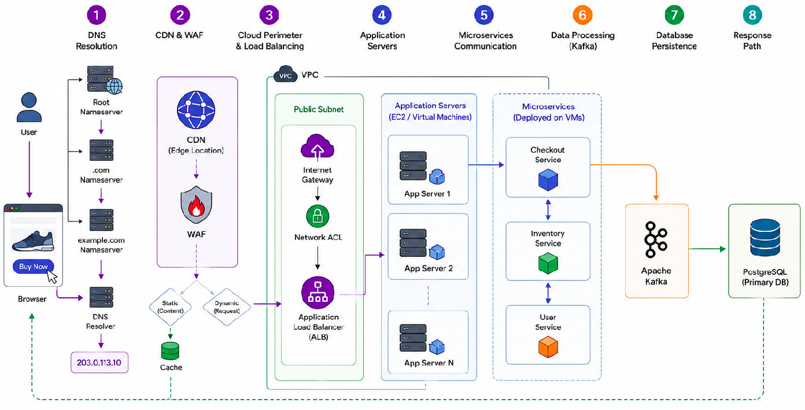
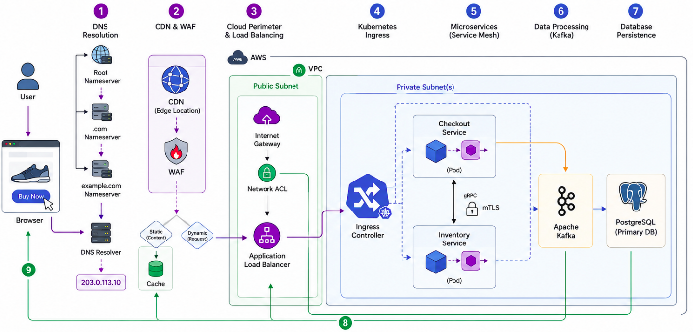

# Part 5: Data Infrastructure & Observability

This final section brings everything together. We look at networking for massive data systems, how to monitor complex networks, and trace a single request through the entire stack.

---

## MODULE 15: DATA ENGINEERING INFRASTRUCTURE

Data platforms move petabytes of data, requiring incredibly robust underlying networks.

### End-to-End Data Platform Architecture

Modern data architectures consist of several stages:

1. **Ingestion:** Moving raw data into the system (e.g., IoT sensors sending telemetry, databases streaming change logs).
2. **Storage:** Storing massive volumes of data cheaply (Data Lakes).
3. **Processing:** Transforming the data (Batch or Stream processing).
4. **Serving:** Querying the data for analytics (Data Warehouses).

### Key Data Technologies and Networking Considerations

* **Apache Kafka:** A distributed event streaming platform. 

  * *Networking aspect:* Kafka brokers communicate heavily with each other to replicate data partitions. Requires extremely low-latency, high-bandwidth internal networks.

* **Apache Spark:** A unified analytics engine for large-scale data processing.

  * *Networking aspect:* Spark workers constantly shuffle data across the network during complex queries. If the network is slow, the query takes hours instead of minutes.

* **Data Lakes (e.g., AWS S3):** Vast object storage for unstructured data.

  * *Networking aspect:* Accessing S3 from within a VPC shouldn't go over the public internet. We use **VPC Endpoints** to route traffic directly over the cloud provider's internal backbone, saving massive amounts of money on data egress fees.

* **Data Warehouses (e.g., Snowflake, BigQuery):** Highly structured databases for analytics.

> **Module 15 Key Takeaways:** Data platforms put immense strain on East-West network traffic. Optimizing network paths (like using VPC endpoints) is a critical skill for Data Engineers to reduce costs and improve query speeds.

---

## MODULE 16: OBSERVABILITY AND MONITORING

You cannot fix what you cannot see. Observability is the practice of instrumenting systems to gather actionable data about their behavior.

### The Three Pillars of Observability

1. **Metrics:** Numerical data measured over time (e.g., "CPU is at 80%", "Network bandwidth is 5Gbps").
2. **Logs:** Immutable records of discrete events (e.g., "User Admin logged in at 12:01 PM from IP 192.168.1.5").
3. **Traces:** A representation of a single user's journey through an entire distributed system, showing exactly how long the request spent in each microservice.

### Essential Observability Tools

* **Prometheus:** An open-source systems monitoring and alerting toolkit. It "scrapes" metrics from your infrastructure and stores them in a time-series database.
* **Grafana:** A visualization tool that connects to Prometheus (and other sources) to create beautiful, real-time dashboards.
* **ELK Stack (Elasticsearch, Logstash, Kibana):** The industry standard for centralized logging. It collects logs from thousands of servers, makes them searchable, and visualizes the data.
* **OpenTelemetry:** A standardized framework for generating and capturing metrics, logs, and traces.

### Network Monitoring Strategies

Network monitoring specifically looks for:

* Packet loss and latency spikes.
* Unusual traffic patterns (which could indicate a DDoS attack or data exfiltration).
* BGP route flapping.
* DNS query failures.

> **Module 16 Key Takeaways:** In a cloud-native world with ephemeral containers, traditional monitoring fails. You must rely on distributed tracing, centralized logging, and robust metrics to troubleshoot issues.

---

## MODULE 17: COMPLETE END-TO-END REQUEST FLOW

Let's put all 16 modules together. What exactly happens when a user opens an app, clicks a button, and buys a product?

### The Scenario: A User buys a shoe on `shop.example.com`

#### Without Kubernetes

#### With Kubernetes

#### 1. **DNS Resolution:**

* The user's browser queries the local DNS resolver. It recursively asks the Root, `.com`, and `example.com` Authoritative Nameservers.
* DNS returns an IP address: `203.0.113.10` (which is the public IP of our CDN/WAF).

#### 2. **CDN & WAF (Web Application Firewall):**

* The user establishes a TCP connection and TLS handshake with the CDN edge server closest to them.
* The WAF inspects the HTTP request to ensure it's not a SQL Injection or Cross-Site Scripting attack.
* If the request is for a static image of the shoe, the CDN serves it from cache immediately. 
* Since this is a dynamic "Purchase" request, the CDN forwards the traffic to the Cloud Load Balancer.

#### 3. **Cloud Perimeter & Load Balancing:**

* Traffic hits the **Internet Gateway (IGW)** of the AWS VPC.
* The **Network ACL** on the Public Subnet allows the traffic.
* Traffic reaches the **Application Load Balancer (ALB)**.
* The ALB terminates the TLS connection, inspects the HTTP headers, and determines it needs to go to the Kubernetes cluster.

#### 4. **Kubernetes Ingress:**

* The ALB forwards the traffic to the **Kubernetes Ingress Controller** (running on Worker Nodes in a Private Subnet).
* The Ingress Controller looks at the URL path (`/purchase`) and routes it to the internal `Checkout Service`.

#### 5. **Microservices (Service Mesh):**

* The traffic enters the Service Mesh proxy sidecar of the Checkout Pod. 
* The Checkout Service needs to verify inventory. It makes an internal gRPC call to the `Inventory Service`. The Service Mesh handles internal DNS resolution, encrypts the traffic (mTLS), and routes it to an available Inventory Pod.

#### 6. **Data Processing (Kafka):**

* The Inventory Service confirms stock. The Checkout Service completes the transaction.
* The Checkout Service publishes an event: `"Order Placed: Order #12345"` to an internal **Apache Kafka** cluster.

#### 7. **Database Persistence:**

* The Checkout Service also commits the final transaction to the primary relational database (e.g., PostgreSQL).

#### 8. **Response:**

* An HTTP `200 OK` response travels back through the Service Mesh proxy $\rightarrow$ Ingress Controller $\rightarrow$ Application Load Balancer $\rightarrow$ CDN $\rightarrow$ User's Browser.
* The browser renders the "Thank you for your purchase!" page.

### Post-Request Asynchronous Flow

Meanwhile, backend systems react to the Kafka event:

* An **Email Service** consumes the Kafka event and sends a receipt.
* A **Data Warehouse** ingestion job consumes the Kafka event, routing it over a VPC Endpoint to an S3 Data Lake, and then into Snowflake for the analytics team to review sales trends tomorrow.

> **Final Conclusion:** You have successfully traced a packet from a physical keyboard through the global internet, into a cloud VPC, down into a virtualized container network, through an event-streaming platform, and into a data warehouse. You now understand the full stack of modern Cloud Networking!

---
[Proceed to Appendices: Interview Questions](interview-questions.md)
