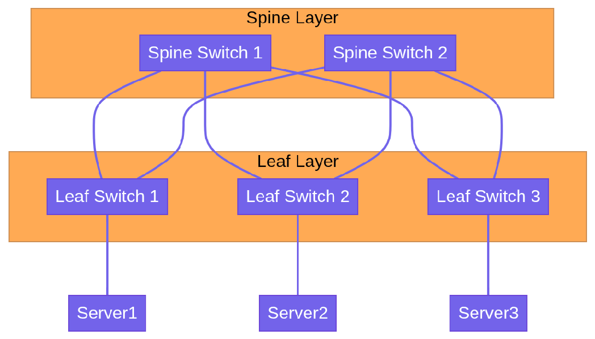

# Part 3: Data Centers, Virtualization & Containers

This section transitions from physical hardware to the abstractions that power modern application deployment.

---

## MODULE 8: DATA CENTER NETWORKING

A Data Center (DC) is a facility that houses massive amounts of IT infrastructure. Cloud providers like AWS and Azure are essentially just renting you space and compute in their hyper-scale data centers.

### Data Center Fundamentals

* **Servers:** High-powered computers mounted in metal racks. They don't have monitors or keyboards; they are managed remotely.
* **Storage Systems:** 

  * **DAS (Direct Attached Storage):** Hard drives inside the server itself.
  * **NAS (Network Attached Storage):** File-level storage accessible over the network.
  * **SAN (Storage Area Network):** High-speed, block-level network dedicated purely to storage (often using Fibre Channel or iSCSI). It makes remote storage appear as if it were a local hard drive to the server.

### Traditional 3-Tier Architecture

Historically, DC networks were built in a 3-Tier (Hierarchical) model:

1. **Core Layer:** The extremely fast backbone of the network. Connects to the internet.
2. **Aggregation (Distribution) Layer:** Aggregates traffic from the access layer. Applies policies, routing, and firewall rules.
3. **Access Layer:** The Top-of-Rack (ToR) switches that the physical servers directly plug into.

*Drawback:* This architecture is great for "North-South" traffic (user to server), but terrible for "East-West" traffic (server talking to another server), which is what modern applications do heavily.

### Modern Spine-Leaf Architecture

To solve the East-West traffic problem, modern DCs use the **Spine-Leaf** architecture.

* **Rules of Spine-Leaf:**

  1. Every leaf connects to every spine.
  2. Spines never connect to other spines. Leaves never connect to other leaves.

* **Benefit:** Every server is exactly the same distance away from every other server (always exactly 3 hops: Leaf -> Spine -> Leaf). This ensures highly predictable latency and massive bandwidth for East-West traffic.

### Redundancy and High Availability
In a DC, everything must have a backup.
* Dual power supplies.
* Dual network cards (NICs) in servers bonded together (LACP).
* Dual Top-of-Rack switches.
* Redundant Internet paths (BGP multi-homing).

> **Module 8 Key Takeaways:** Data Centers have shifted from 3-Tier designs to Spine-Leaf architectures to support the massive amount of server-to-server (East-West) traffic required by modern distributed applications.

---

## MODULE 9: VIRTUALIZATION

In the past, one physical server ran one operating system and one application. This was highly inefficient, as the server's CPU and RAM sat idle most of the time.

### Hypervisors and Virtual Machines
**Virtualization** uses software to simulate hardware functionality and create a virtual computer system.
A **Hypervisor** is the software that creates and runs Virtual Machines (VMs). It carves out fractions of the physical server's CPU, RAM, and Storage, and assigns them to isolated VMs. Each VM runs its own full Operating System (Guest OS).

* **Type 1 Hypervisor (Bare-Metal):** Installs directly on the server hardware. Very efficient. Used in enterprise Data Centers. (Examples: VMware ESXi, KVM, Microsoft Hyper-V).
* **Type 2 Hypervisor (Hosted):** Installs on top of a normal OS like Windows or macOS. (Examples: VirtualBox, VMware Workstation).

### Virtual Networking
When you have 10 VMs running inside one physical server, how do they talk to the network?
The hypervisor creates a **Virtual Switch (vSwitch)** inside software. 
* The VMs connect their "virtual network cards (vNICs)" to the vSwitch.
* The vSwitch connects to the physical server's physical network card (pNIC).
* The pNIC connects to the physical Top-of-Rack switch.

> **Module 9 Key Takeaways:** Virtualization abstracted the hardware. A Virtual Machine acts exactly like a physical computer, but it's just a set of files managed by a Hypervisor.

---

## MODULE 10: CONTAINERS

Virtual Machines are great, but they are heavy. Every VM requires a full Operating System (e.g., 20GB of disk space and 2GB of RAM just to run Windows or Linux before your app even starts). 

### Container Fundamentals
Containers abstract the *Operating System*, not the hardware. 
Multiple containers run on the same machine and share the host's Operating System kernel. They are incredibly lightweight (megabytes instead of gigabytes) and boot up in milliseconds.

### Docker Architecture
**Docker** popularized containerization. 
* **Dockerfile:** A script containing instructions on how to build a container image.
* **Image:** A read-only template with the application and all its dependencies.
* **Container:** A running instance of an image.
* **Registry:** A place to store and share images (e.g., Docker Hub, AWS ECR).

### Container Networking Basics
By default, Docker containers on the same host can talk to each other using an internal software bridge network. However, to access them from the outside, you must map a port on the host machine to a port on the container.
* *Example:* Map host port `8080` to container port `80`. When traffic hits `http://host_ip:8080`, Docker routes it into the container on port `80`.

> **Module 10 Key Takeaways:** VMs virtualize hardware (heavy). Containers virtualize the OS (lightweight). Containers ensure that an application runs exactly the same on a developer's laptop as it does in production.

---

## MODULE 11: KUBERNETES NETWORKING

When you have 5 containers, Docker is fine. When you have 5,000 containers spread across 100 servers, you need an orchestrator. **Kubernetes (K8s)** automates the deployment, scaling, and management of containerized applications.

### Kubernetes Architecture
* **Control Plane (Master Node):** The brain. Makes global decisions about the cluster (scheduling, detecting node failures).
* **Worker Nodes:** The servers that actually run the applications.
* **Pod:** The smallest deployable unit in Kubernetes. A Pod contains one or more containers that share the same IP address and storage.

### The Kubernetes Networking Model
Kubernetes has fundamental networking rules:
1. Every Pod gets its own unique IP address.
2. All Pods can communicate with all other Pods without NAT.
3. Nodes can communicate with all Pods without NAT.

### CNI (Container Network Interface)
Kubernetes doesn't actually implement networking itself. It relies on plugins called CNIs (like Calico, Flannel, or Cilium) to wire up the virtual networks, assign IPs to Pods, and ensure the networking rules are met.

### Services and Load Balancing
Pods are ephemeral—they die and are recreated constantly, and their IP addresses change every time. You cannot rely on a Pod's IP address.

To solve this, Kubernetes uses **Services**. 
A Service provides a stable, static IP address and DNS name that sits in front of a group of Pods. It acts as an internal Load Balancer.
* **ClusterIP:** The default. The Service is only reachable from *inside* the K8s cluster.
* **NodePort:** Opens a specific port on every Worker Node to allow external traffic to hit the Service.
* **LoadBalancer:** Automatically provisions a cloud provider's Load Balancer (like AWS ALB) to route external internet traffic into the cluster.

### Ingress
While a LoadBalancer service is great, if you have 50 web apps, creating 50 AWS Load Balancers gets extremely expensive.
An **Ingress** acts as a smart router. It uses one single IP address / external Load Balancer, and routes traffic to different Services based on the HTTP URL path or hostname (e.g., `api.example.com` goes to the API service, `example.com/blog` goes to the Blog service).

### Network Policies
By default, all Pods in K8s can talk to all other Pods (Zero Trust is violated!).
**Network Policies** are the firewalls of Kubernetes. They are rules that specify exactly which Pods are allowed to communicate with which other Pods.

> **Module 11 Key Takeaways:** Kubernetes networking is complex. Pods get IPs via CNI. Services provide stable internal load balancing for ephemeral Pods. Ingress handles HTTP routing from the outside world.

---
[Proceed to Part 4: Cloud & Cloud-Native](cloud-native.md)
