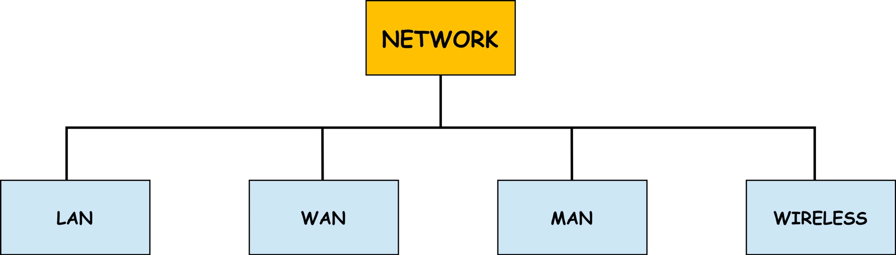
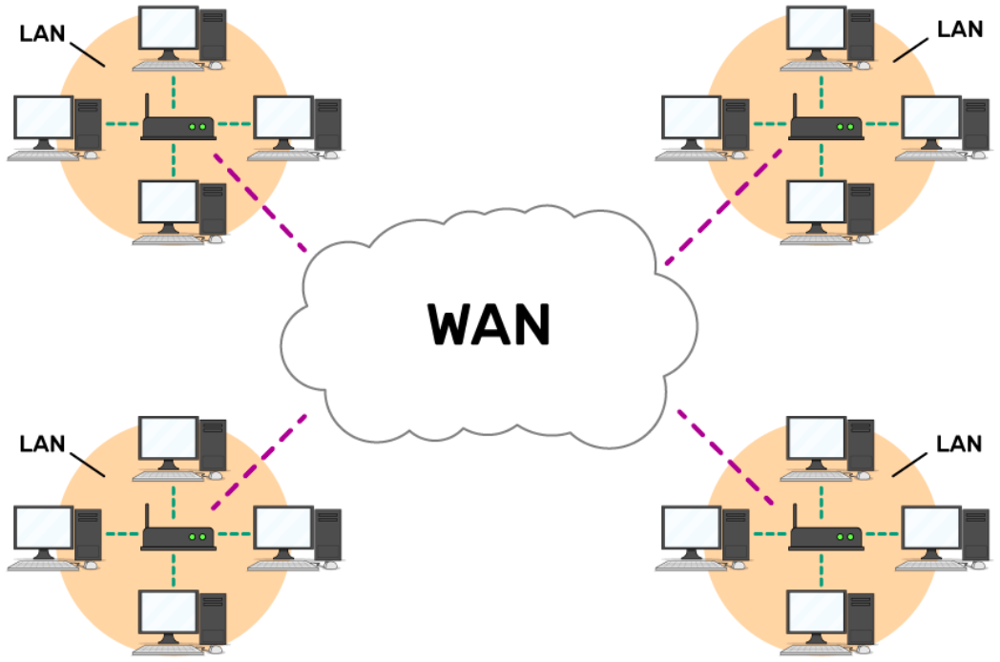
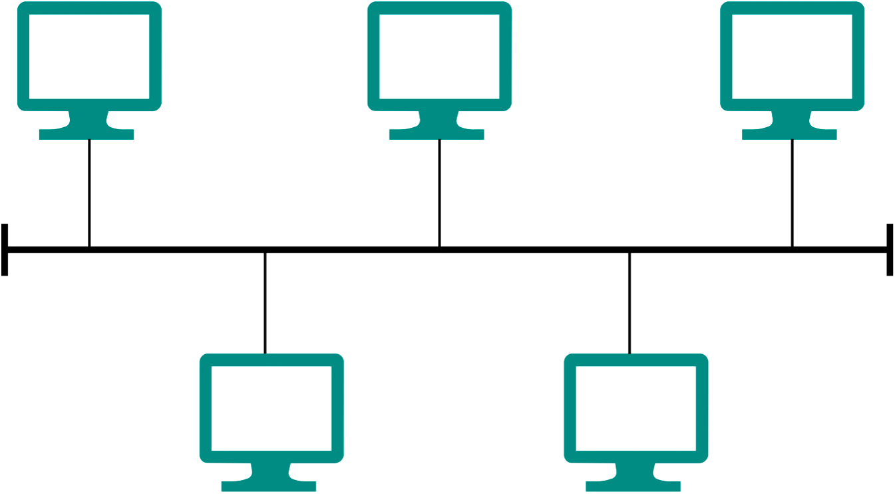
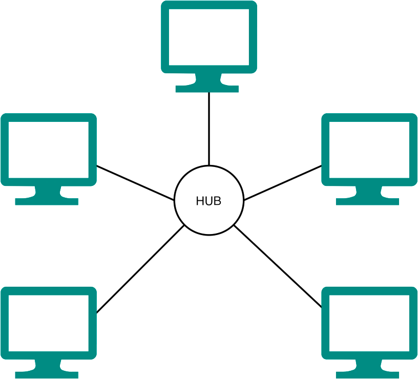
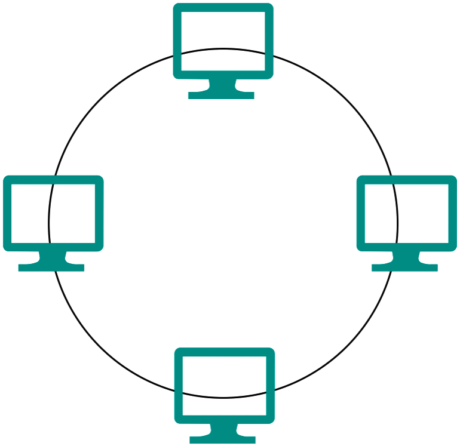
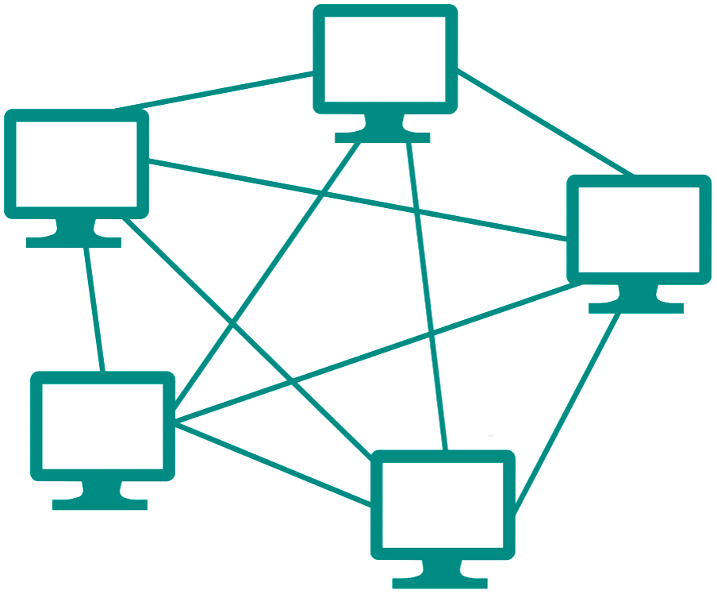
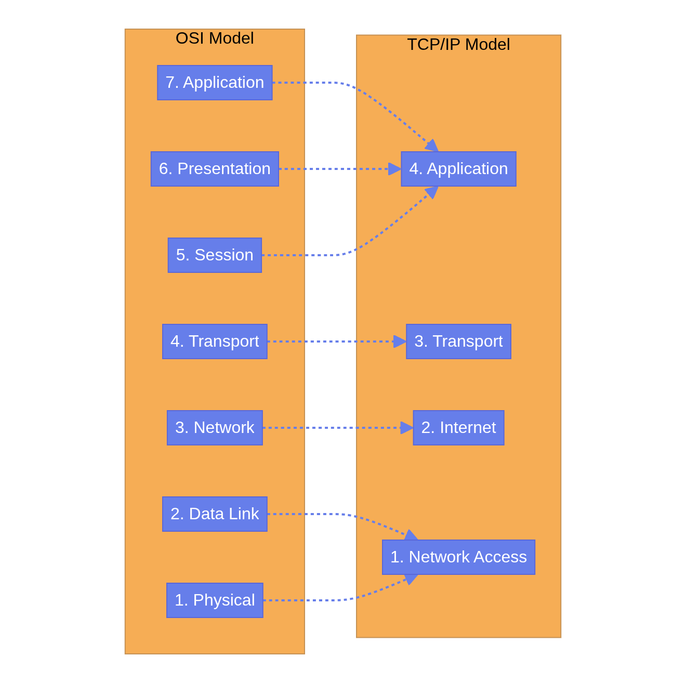
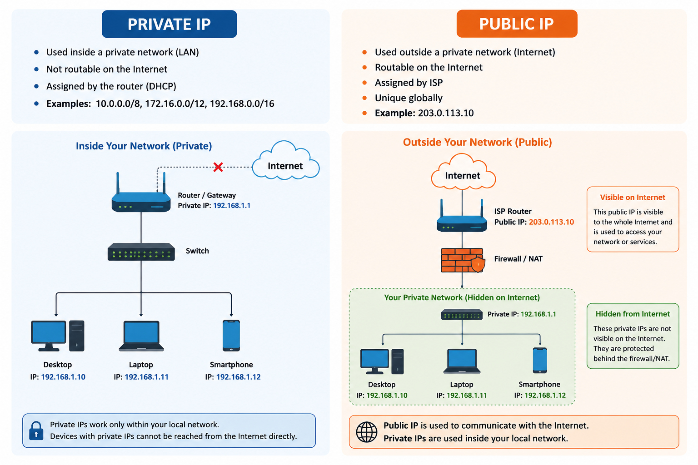

# Part 1: Networking Fundamentals

Welcome to Part 1. This section covers the foundational concepts of computer networking, laying the groundwork for everything else in this tutorial. 

---

## MODULE 1: NETWORKING FUNDAMENTALS

### What is a computer network?
A computer network is simply a group of two or more interconnected computing devices that can share data and resources. Think of it like a conversation between two people; to communicate, they need a shared language, a medium (like air for sound), and a set of rules for taking turns speaking. In networking, computers use cables or wireless signals (medium) and protocols (rules) to share information.

### Network Types (Based on Scope)
Networks are categorized by their physical size and geographic reach:

> Few images are taken from: [https://www.learnelectronicsindia.com/post/collection-of-computers?srsltid=AfmBOorcINEG3lYJvPMSozMDfle8QihA_bYO0D9E7qNWYo_xldYG5bBa](https://www.learnelectronicsindia.com/post/collection-of-computers?srsltid=AfmBOorcINEG3lYJvPMSozMDfle8QihA_bYO0D9E7qNWYo_xldYG5bBa)

- **PAN (Personal Area Network):** Covers a very small area, usually within a few meters of a person. Example: Connecting Bluetooth headphones to a smartphone.
- **LAN (Local Area Network):** Covers a single room, building, or campus. Example: Your home Wi-Fi network or an office network. LANs are typically fast and privately owned.
- **MAN (Metropolitan Area Network):** Covers a city or a large campus. Example: A city-wide public Wi-Fi network.
- **WAN (Wide Area Network):** Spans large geographical distances, connecting multiple LANs together. Example: The Internet itself is the largest WAN.

---

---

### Client-Server vs. Peer-to-Peer Architecture
How do devices communicate on these networks? There are two primary models:

#### 1. **Client-Server Architecture:**

- **Server:** A powerful, centralized machine that provides resources or services (e.g., a web server hosting a website).
- **Client:** A device (like your laptop or phone) that requests services from the server.
   
   **Analogy:** Ordering food at a restaurant. You are the client requesting food; the kitchen is the server fulfilling the request.

#### 2. **Peer-to-Peer (P2P) Architecture:**

- Every device on the network is equal (a "peer"). They can both request and provide resources. 
   
**Example:** BitTorrent networks or sharing a folder directly between two laptops on the same Wi-Fi.

### Network Topologies
Topology refers to the physical or logical layout of a network.

- **Bus:** This is the first used #topology. Consists of the main run cable with a terminator at each closure. Uses one long cable called a backbone computer (workstation and servers). 

- **Star:** All nodes connect to a central device (like a switch). Most common in modern LANs.

- **Ring:** Nodes connect in a closed loop.

- **Mesh:** Every node connects to every other node. Offers high redundancy but is expensive. Common in critical infrastructure and wireless sensor networks.

### Data Communication Basics
To measure network performance, we use four key metrics:

- **Bandwidth:** The maximum *capacity* of a link. Think of it as the width of a highway. More lanes = more cars (data) can travel at once. Usually measured in Mbps or Gbps.
- **Throughput:** The *actual* speed of data transfer achieved. It's almost always lower than bandwidth due to network overhead and congestion.
- **Latency:** The *time* it takes for data to travel from source to destination. Measured in milliseconds (ms). Think of it as the time it takes a car to drive the length of the highway.
- **Jitter:** The *variation* in latency. If some data packets arrive in 20ms, others in 50ms, and others in 10ms, you have high jitter. This is terrible for real-time voice and video calls.

### Network Protocols, Encapsulation, and Decapsulation
A **protocol** is a standard set of rules that allow electronic devices to communicate. 

When you send data, it doesn't just fly through the wire raw. It goes through **Encapsulation**:

- Data is wrapped in "envelopes" (headers and trailers) at different layers of the network before transmission. 
- Think of sending a physical letter: You write the letter (data), put it in an envelope, write the recipient's address (IP address), put a stamp on it, and give it to the post office.

When the receiving computer gets the data, it performs **Decapsulation**, stripping away the envelopes layer by layer until the original data is revealed.

> **Module 1 Key Takeaways:** Networks connect devices to share resources. Understanding the physical layout (topology), the communication model (client-server), and performance metrics (bandwidth, latency) is the foundation of network engineering.

---

## MODULE 2: OSI AND TCP/IP MODELS

To standardize network communication, the industry created conceptual models. 

### The OSI Model (Open Systems Interconnection)
The OSI model breaks network communication into 7 distinct layers. It is mostly a theoretical framework used for teaching and troubleshooting.

**Mnemonic to remember:** **P**lease **D**o **N**ot **T**hrow **S**ausage **P**izza **A**way (Bottom to Top).

| Layer # | Layer Name | Description | Example Protocols / Devices |
| :--- | :--- | :--- | :--- |
| **7** | **Application** | Network interface for user applications. | HTTP, HTTPS, FTP, SMTP |
| **6** | **Presentation** | Data formatting, encryption, and compression. | SSL/TLS, JPEG, ASCII |
| **5** | **Session** | Establishes, maintains, and terminates sessions. | RPC, NetBIOS |
| **4** | **Transport** | End-to-end communication, reliability, error recovery. | TCP, UDP |
| **3** | **Network** | Logical addressing and routing (finding the best path). | IP, ICMP, Routers |
| **2** | **Data Link** | Physical addressing (MAC), error detection on local link. | Ethernet, Wi-Fi, Switches |
| **1** | **Physical** | Transmits raw bits over a physical medium (cables/radio). | Cables, Hubs, Fiber optics |

### The TCP/IP Model
While OSI is theoretical, the **TCP/IP model** is what the Internet actually runs on. It's a simplified 4-layer model.

### TCP vs. UDP (Layer 4 Protocols)
At the Transport layer, you choose how data is delivered:

- **TCP (Transmission Control Protocol):** Connection-oriented. It guarantees delivery. If a packet is lost, TCP resends it. It is slower but reliable. (Used for Web browsing, File transfers, Email).
- **UDP (User Datagram Protocol):** Connectionless. "Fire and forget." It does not guarantee delivery and does not resend lost packets. Fast but unreliable. (Used for Video streaming, Online gaming, VoIP).

### Packet Flow Example
When you open a web page:

- **Application Layer (L7):** Browser creates an HTTP GET request.
- **Transport Layer (L4):** Adds a TCP header (source and destination ports). The data is now a **Segment**.
- **Network Layer (L3):** Adds an IP header (source and destination IP addresses). The segment is now a **Packet**.
- **Data Link Layer (L2):** Adds an Ethernet header (source and destination MAC addresses) and a trailer. The packet is now a **Frame**.
- **Physical Layer (L1):** The frame is converted to electrical signals, light pulses, or radio waves and sent over the wire.

> **Module 2 Key Takeaways:** The OSI and TCP/IP models are maps of the network stack. Knowing which protocol operates at which layer is the most critical skill for network troubleshooting. (e.g., "We have a Layer 3 issue" implies a routing/IP problem).

---

## MODULE 3: IP ADDRESSING AND SUBNETTING

IP addresses are the logical addresses of the network world. Every device needs one to communicate over the Internet.

### IPv4 vs. IPv6
- **IPv4:** 32-bit addresses, written in dotted-decimal format (e.g., `192.168.1.10`). Because there are only ~4.3 billion combinations, we ran out of them.
- **IPv6:** 128-bit addresses, written in hexadecimal (e.g., `2001:0db8:85a3:0000:0000:8a2e:0370:7334`). Created to solve IPv4 exhaustion. It provides an almost infinite number of addresses.

### Public vs. Private IP Addresses

IP addresses uniquely identify devices on a network, enabling reliable communication, traffic routing, and data delivery. Based on their routing scope and accessibility, IP addresses are broadly classified into two types:

#### 1. Public IPs
A Public IP Address is an IP address used to communicate outside a local network over the internet.

- These addresses are assigned by Internet Service Providers (ISPs) and must be globally unique.
- They enable direct access from anywhere on the internet, making them suitable for servers, websites, and other publicly accessible services.

> **Types of Public IPs:** 
> - **Dynamic Public IP Address:** These IP address is assigned by the ISP and may change over time, usually when the connection is reset or periodically according to the ISP’s policy. Most home and mobile internet connections use dynamic public IP addresses.
> - **Static Public IP Address:** These IP address remains fixed and does not change and commonly used by servers and services such as web servers, mail servers, and DNS servers that need a consistent and reachable address.

   
#### 2. Private IPs
A Private IP Address is used for communication within a local network (LAN). It enables devices such as computers, smartphones, and printers to exchange data internally.

- These addresses are typically assigned by a router or DHCP server, ensuring that each device on the network has a unique local identifier.
- Private IP addresses are not routable on the public internet, meaning they cannot be accessed directly from outside the local network.
- While this provides network isolation, private IP addresses are not inherently secure.
- Security depends on firewalls, NAT, and proper network configuration
   

Not routable on the Internet. Used inside local networks (LANs). 
* Private IP Ranges:
   - `10.0.0.0` to `10.255.255.255`
   - `172.16.0.0` to `172.31.255.255`
   - `192.168.0.0` to `192.168.255.255`

### NAT and PAT
If private IPs aren't routable on the internet, how do devices in your house access Google? 

**NAT (Network Address Translation)**. Your home router takes the internal private IP address of your laptop and translates it to the single public IP address assigned to your house by your ISP before sending the packet to the Internet. PAT (Port Address Translation) allows multiple devices to share that single public IP by using different port numbers.

### DHCP (Dynamic Host Configuration Protocol)
Assigning IP addresses manually to every device is tedious. DHCP is a protocol that automatically assigns IP addresses, subnet masks, default gateways, and DNS servers to devices when they join a network.

### Subnetting and CIDR Notation
Subnetting is the process of dividing a large network into smaller, more manageable sub-networks. It improves security and reduces broadcast traffic.

An IP address has two parts: a **Network portion** and a **Host portion**. The **Subnet Mask** tells the computer where the split happens.

**CIDR (Classless Inter-Domain Routing) Notation:**
Instead of writing a subnet mask as `255.255.255.0`, we use CIDR notation: `/24`. This means the first 24 bits of the IP address belong to the network, and the remaining 8 bits belong to the hosts.

**Practical Subnetting Example:**
Given the network `192.168.1.0/24`:

- **Network Address:** `192.168.1.0` (The name of the network, cannot be assigned to a device).
- **Usable Host Range:** `192.168.1.1` to `192.168.1.254` (IPs you can give to laptops, servers, etc.).
- **Broadcast Address:** `192.168.1.255` (Used to send a message to ALL devices on this subnet).
- **Total IPs:** 256. **Usable IPs:** 254 (Total - 2).

> **Module 3 Key Takeaways:** Subnetting is the mathematical foundation of cloud networking. You must understand CIDR notation to design VPCs and subnets in AWS, Azure, or GCP.

---

## MODULE 4: NETWORK DEVICES

Networks are built using specialized hardware (or virtual equivalents in the cloud).

### The Evolution of Connectivity

- **Hub (Layer 1):** A dumb device. If a packet comes into one port, the hub copies it and shouts it out to all other ports. Creates massive congestion. Obsolete.
- **Switch (Layer 2):** A smart device. It learns which device (MAC address) is connected to which port. When a packet arrives, it sends it *only* to the specific port of the destination device. Used to connect devices within the *same* LAN.
- **Router (Layer 3):** Connects *different* networks together (e.g., connecting your home LAN to the ISP's network). Routers use IP addresses to determine the best path to send a packet across the internet.

### Network Boundaries and Security

- **Gateway:** A broad term for a node that serves as an entrance to another network. A router acting as the exit point for a LAN is the "Default Gateway".
- **Firewall:** A security device that monitors and controls incoming and outgoing network traffic based on predetermined security rules. It establishes a barrier between a trusted internal network and the untrusted Internet.
- **Proxy:** An intermediary server that makes requests on behalf of clients. Often used for web filtering, caching, and masking client IP addresses.

### Advanced Devices

- **Load Balancer:** Distributes incoming network traffic across a group of backend servers. This ensures no single server becomes overwhelmed, providing high availability and reliability. (Crucial for modern cloud apps).
- **IDS and IPS (Intrusion Detection/Prevention Systems):** Deeply inspects network traffic to find malicious activity. IDS only alerts you; IPS actively blocks the threat.
- **Wireless Access Point (WAP):** Allows wireless devices to connect to a wired network using Wi-Fi.

### Hardware vs. Virtual Appliances
Historically, firewalls and load balancers were heavy, expensive physical metal boxes mounted in server racks. Today, in Cloud and Cloud-Native environments, these are mostly **Virtual Appliances**—software running on standard servers that perform the exact same networking functions.

> **Module 4 Key Takeaways:** Switches connect devices locally (using MAC addresses). Routers connect networks globally (using IP addresses). Firewalls protect boundaries. Load balancers scale applications.

---
[Proceed to Part 2: Routing, Switching & Security](routing-security.md)
