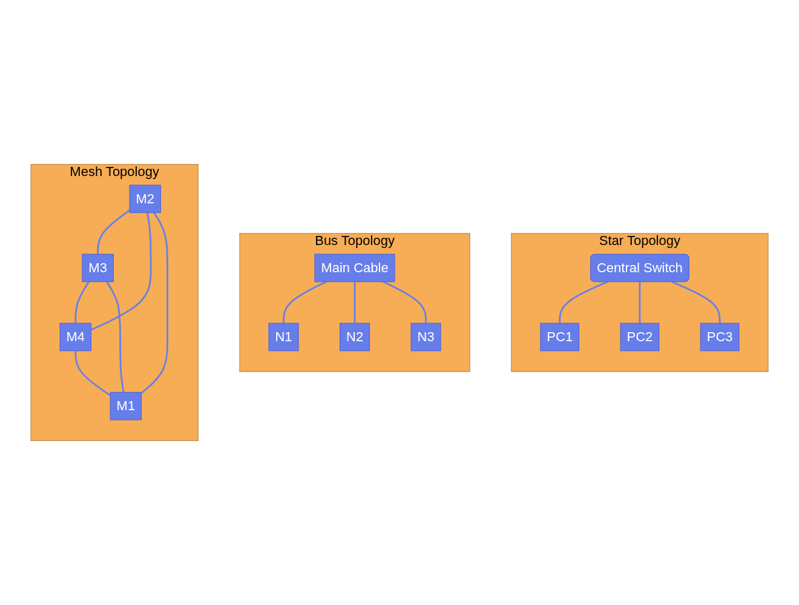

# Computer Network Engineering

Welcome to a complete learning platform covering:

* Computer Networking
* Routing & Switching
* Network Security
* Data Center Architecture
* Cloud Networking
* Kubernetes Networking
* Data Engineering Infrastructure
* Observability & Monitoring

## Learning Path

### Level 1

* Network Fundamentals
* OSI Model
* TCP/IP
* Subnetting

### Level 2

* Routing
* Switching
* VLANs
* DNS

### Level 3

* Firewalls
* VPNs
* IDS/IPS
* Security

### Level 4

* Data Centers
* Virtualization
* Containers
* Kubernetes

### Level 5

* AWS Networking
* Azure Networking
* Cloud Architecture

### Level 6

* Kafka
* Spark
* Data Lakes
* Monitoring

Start with the Fundamentals section from the navigation menu.
