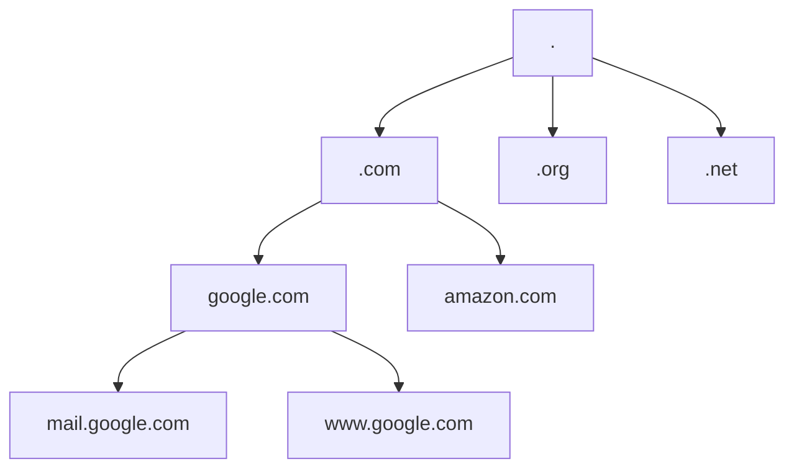

# Part 2: Routing, Switching & Security

This section covers how the internet functions at scale, how traffic is securely routed between networks, and the core principles of network security.

---

## MODULE 5: DNS AND INTERNET INFRASTRUCTURE

### DNS Architecture: The Phonebook of the Internet
Computers communicate using IP addresses (e.g., `142.250.190.46`), but humans remember names (e.g., `google.com`). **DNS (Domain Name System)** translates human-readable domain names into machine-readable IP addresses.

DNS is a globally distributed, hierarchical database.

### Recursive vs. Authoritative DNS
* **Recursive Resolver:** The middleman. When you type `google.com`, your laptop asks the Recursive Resolver (usually provided by your ISP or a public one like `8.8.8.8`). If it doesn't know the IP, it recursively hunts down the answer by querying the Root, TLD, and Authoritative servers.
* **Authoritative Nameserver:** The final boss. This server holds the actual, official DNS records for a domain. It says "Yes, I am the authority for google.com, and its IP is X."

### Common DNS Record Types
* **A Record:** Maps a domain name to an IPv4 address.
* **AAAA Record:** Maps a domain name to an IPv6 address.
* **CNAME (Canonical Name):** Maps a domain name to another domain name (an alias). E.g., `www.example.com` points to `example.com`.
* **MX (Mail Exchange):** Directs email to a mail server.
* **TXT:** Holds arbitrary text data, often used to verify domain ownership and for email security (SPF/DKIM/DMARC).

### Content Delivery Networks (CDN)
A CDN is a geographically distributed group of servers that work together to provide fast delivery of Internet content.
Instead of every user worldwide pulling an image from a single server in New York, a CDN caches that image on "Edge Servers" in Tokyo, London, and Sydney. Users pull the image from the edge server closest to them, drastically reducing latency.

### How a Browser Accesses a Website (Step-by-Step)
1. You type `www.example.com`.
2. Browser checks its local cache. If not found, it queries the OS cache.
3. OS queries the DNS Recursive Resolver.
4. Resolver finds the IP address and returns it to the browser.
5. Browser initiates a TCP 3-way handshake with the web server at that IP.
6. Browser initiates a TLS handshake to secure the connection (HTTPS).
7. Browser sends an HTTP GET request for the web page.
8. Server responds with HTML.
9. Browser renders the HTML and makes further requests for images, CSS, and JS (often from a CDN).

> **Module 5 Key Takeaways:** DNS is critical infrastructure. If DNS goes down, the internet feels broken. CDNs are essential for modern web performance by moving static assets closer to the user.

---

## MODULE 6: ROUTING AND SWITCHING

Now we look at how data actually navigates the physical and logical paths of the network.

### Switching, VLANs, and Trunking
* **VLAN (Virtual LAN):** A logical subnetwork that groups a collection of devices from different physical LANs. It allows you to segment a network on a single physical switch. E.g., You can have Port 1-10 belong to the "HR VLAN" and Port 11-20 belong to the "Engineering VLAN." They cannot talk to each other without a router.
* **Trunking (802.1Q):** If you have two switches and want to pass multiple VLANs between them over a single cable, you configure that cable as a "Trunk". It tags Ethernet frames with their VLAN ID so the receiving switch knows where it belongs.
* **STP (Spanning Tree Protocol):** If you wire switches in a loop (for redundancy), packets will circulate forever, causing a "Broadcast Storm" that crashes the network. STP mathematically detects loops and blocks redundant paths, unblocking them only if the primary path fails.

### Routing: Finding the Best Path
Routing is how a router decides where to send a packet next. It maintains a **Routing Table**—a map of network destinations and the "next hop" to get there.

**Static vs. Dynamic Routing:**
* **Static Routing:** A human manually types the routes into the router. Secure and uses no CPU overhead, but terrible for large networks because if a link goes down, the router doesn't automatically adapt.
* **Dynamic Routing:** Routers run protocols to talk to each other, automatically sharing information about connected networks. If a link goes down, they automatically calculate a new path.

### Dynamic Routing Protocols
* **IGP (Interior Gateway Protocol):** Used *inside* an organization's network.
  * **RIP (Routing Information Protocol):** Old, uses "hop count" (number of routers) to find the best path.
  * **OSPF (Open Shortest Path First):** Modern and complex. Uses the "cost" (bandwidth/speed) of links to mathematically calculate the fastest path using Dijkstra's algorithm.
* **EGP (Exterior Gateway Protocol):** Used to route *between* different organizations.
  * **BGP (Border Gateway Protocol):** The protocol of the Internet. It connects different ISPs and massive corporate networks (Autonomous Systems). BGP makes routing decisions based on paths, network policies, and rules configured by network administrators.

> **Module 6 Key Takeaways:** Switching happens at Layer 2 (MAC addresses, VLANs). Routing happens at Layer 3 (IP addresses, OSPF, BGP). Segmentation via VLANs is a fundamental security and performance practice.

---

## MODULE 7: NETWORK SECURITY

Network security is the practice of preventing and protecting against unauthorized intrusion into corporate networks.

### Firewalls and Network Segmentation
A firewall sits at the boundary of a network and filters traffic based on rules.
* **Stateless Firewall:** Looks at each packet individually. Fast but easily fooled.
* **Stateful Firewall:** Remembers the "state" of the connection. If you initiate a connection from inside to the outside, it automatically allows the returning traffic.
* **Next-Generation Firewall (NGFW):** Can look deep into Layer 7 (Application layer) to block specific apps (e.g., allow Facebook but block Facebook Games) and includes built-in Intrusion Prevention (IPS).

### VPNs (Virtual Private Networks)
A VPN creates a secure, encrypted "tunnel" over a public network (like the Internet).
* **Site-to-Site VPN:** Connects two physical office buildings together securely over the internet.
* **Remote Access VPN:** Connects a single remote worker (from a coffee shop) securely to the corporate network.

### SSL/TLS, PKI, and Certificates
How do you know `google.com` is actually Google and not an attacker?
* **SSL/TLS:** Protocols that encrypt data in transit (the "S" in HTTPS).
* **PKI (Public Key Infrastructure):** The system of digital certificates and Certificate Authorities (CAs) that verify identities.
* **Certificates:** A digital passport. A trusted third party (the CA) mathematically signs Google's public key, proving they own the domain. 

### Zero Trust Networking
Historically, networks used a "Castle and Moat" model: heavily defend the perimeter (firewall), but once you are inside the network, you are trusted. 
**Zero Trust** changes this. The philosophy is "Never Trust, Always Verify." 
Every user, device, and application is treated as hostile by default, regardless of whether they are on the corporate LAN or at home. Access is granted based on identity, device health, and strict least-privilege policies.

### Identity and Access Management (IAM)
IAM ensures the right people have the right access to the right resources. It involves:
* **Authentication:** Who are you? (Passwords, Multi-Factor Authentication/MFA, Biometrics).
* **Authorization:** What are you allowed to do? (Role-Based Access Control/RBAC).

### Common Attack Vectors
* **DDoS (Distributed Denial of Service):** Overwhelming a server or network with fake traffic so legitimate users can't access it.
* **Man-in-the-Middle (MitM):** An attacker intercepts communication between two parties to steal data.
* **Phishing:** Tricking users into revealing credentials.
* **Ransomware:** Malware that encrypts data and demands payment for the decryption key. Often spreads laterally through poorly segmented networks.

> **Module 7 Key Takeaways:** Security is layered (Defense in Depth). Firewalls protect boundaries, TLS encrypts data in transit, IAM verifies users, and Zero Trust ensures no implicit trust is granted anywhere.

---
[Proceed to Part 3: Data Centers & Virtualization](datacenter-containers.md)
